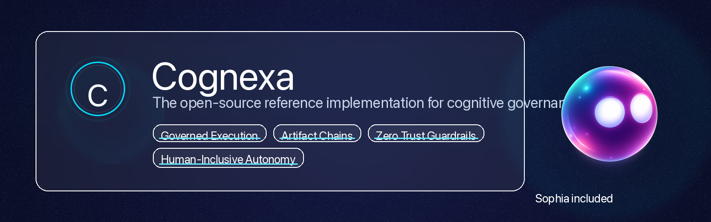
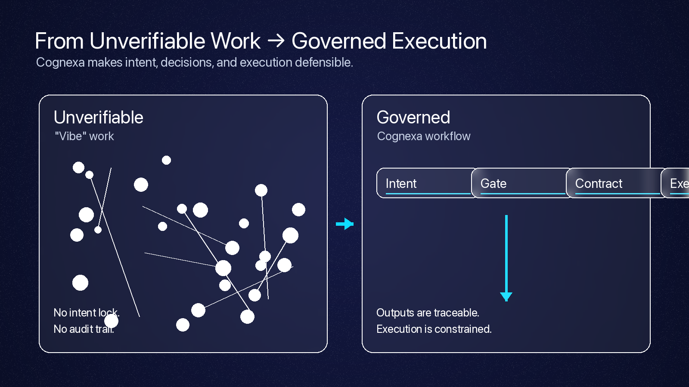
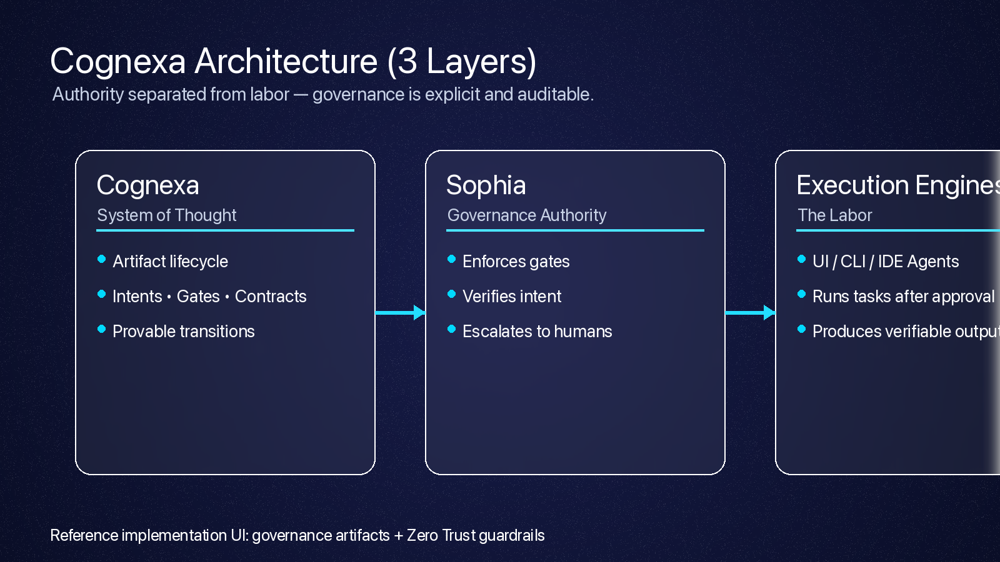

<div align="center">
  
</div>

# Cognexa (Reference Implementation)

**Cognexa is a cognitive governance system.** This repo is the first open-source “reference implementation” of Cognexa-compliant work—positioning **Sophia** as the governance authority for human-inclusive autonomy.

If you’re a vibe coder: Cognexa keeps you fast *without* becoming reckless.

If you’re an enterprise architect: Cognexa makes AI-assisted work **auditable, defensible, and repeatable**.

---

## Start here

1. **Read the mission** (below) to understand why governance is the point.
2. **Run the UI** to see artifacts + guardrails in action.
3. **Skim the architecture** to understand the 3-layer separation.

```bash
npm ci
npm run dev
```

---

## The mission: structure for the AI era

Modern work is increasingly performed by a mix of humans and AI, but the hardest parts of work—**intent, decisions, accountability**—are usually implicit. In practice, that means:

- Requirements drift (quietly).
- Code changes become “because the model said so.”
- Security and compliance degrade as side effects.

Cognexa is the antidote: **turn thinking into first-class artifacts** and enforce a governed lifecycle from idea → execution → verification.

<div align="center">
  
</div>

---

## The core idea: authority separated from labor

Cognexa explicitly separates the **authority to decide** from the **labor to execute**.

- **Cognexa (System of Thought):** the artifact model and lifecycle rules.
- **Sophia (Governance Authority):** judgement, gates, verification, escalation.
- **Execution Engines (Labor):** UI/CLI/agents that do the work *after approval*.

<div align="center">
  
</div>

### Sophia


If Cognexa is the mind, **Sophia** is the faculty of judgment.

Sophia does not execute work. She governs the conditions under which work is *allowed* to happen—enforcing gates, locking intent, verifying constraints, and ensuring the chain is auditable.

<br clear="left" />

---

## Why it matters

When work becomes “prompt-shaped,” the failure modes are subtle until they’re catastrophic.

Cognexa is built to make AI-assisted work:

- **Provable:** a verifiable artifact chain from intent to outcome.
- **Safer by default:** governance is a security control (Zero Trust posture).
- **Composable:** governance can outlive any single tool or agent.

---

## What’s in this repo

- A React + Vite + TypeScript UI that renders governance artifacts.
- A Zero Trust guardrail modal (the “Copy Code” gate) to demonstrate gate enforcement.
- A docs suite that treats governance like a first-class engineering surface.

---

## Getting started

**Prerequisites:** Node.js 18+

```bash
# 1) Install dependencies (clean install keeps version integrity)
npm ci

# 2) Start the dev server
npm run dev

# 3) Build
npm run build
```

---

## Documentation

- **[Architecture Reference](docs/ARCHITECTURE.md)** - Cognexa, Sophia, and the execution layer.
- **[Meet Sophia](docs/MEET_SOPHIA.md)** - Persona, mission, and guardrails.
- **[Security Policy](SECURITY.md)** - Governance-first Zero Trust posture.
- **[Contributing](CONTRIBUTING.md)** - Correctness over speed.

---

## Media

- `assets/cognexa-banner.png`
- `assets/problem-solution.png`
- `assets/cognexa-architecture.png`
- `assets/cognexa-logo.png`
- `assets/social-preview.png`

---

<div align="center">
  Made with ❤️ by <strong>Thalamus</strong>
</div>
