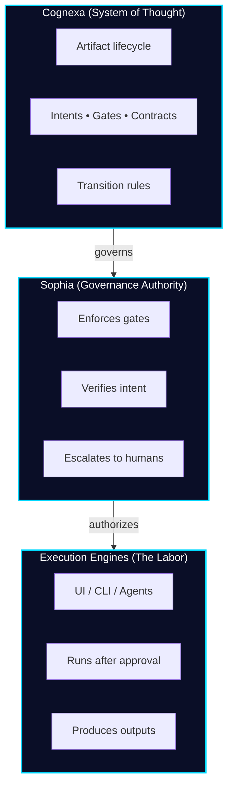
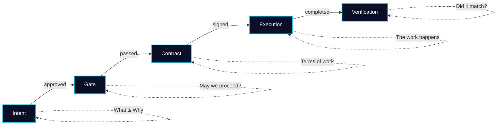
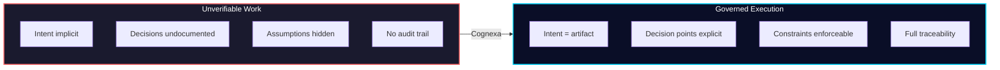
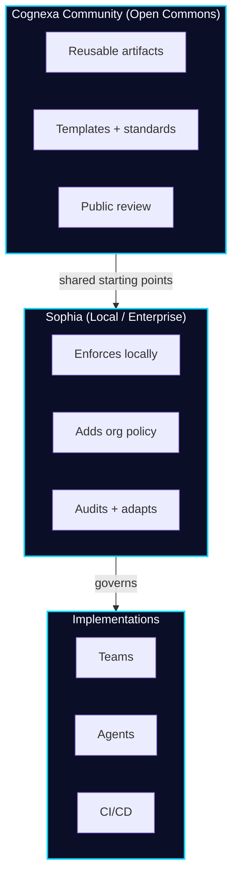

<div align="center">

# Cognexa Community

**A shared system of judgment for AI-assisted work.**

[](LICENSE)
[](https://www.typescriptlang.org/)
[](https://react.dev/)

</div>

---

## This is not a prompt library.

This is not an agent marketplace.  
This is not about speed.

**This is about judgment.**

AI has made execution cheap and abundant. What it has *not* made cheap is knowing **what should be done, when, and under what constraints**.

Most failures in AI-assisted work don't come from bad tools—they come from:

- Unclear intent
- Missing requirements  
- Unspoken assumptions
- Skipped decision points
- Work starting before thinking is complete

**Cognexa Community exists to solve that problem by making thinking reusable.**

---

## The Core Idea: Authority Separated from Labor



| Layer | Role | What it does |
|:------|:-----|:-------------|
| **Cognexa** | System of Thought | Defines the artifact model, lifecycle rules, and transition logic |
| **Sophia** | Governance Authority | Enforces gates, verifies intent, escalates to humans |
| **Execution** | The Labor | UI, CLI, agents—runs *only after* governance approves |

> Nothing in this repo executes work.  
> Everything in this repo governs *whether work should happen at all*.

---

## Meet Sophia


**Sophia** is the Self-Organizing Platform for Human-Inclusive Autonomy.

If Cognexa is the mind, Sophia is the faculty of **judgment**.

She doesn't replace humans—she amplifies them. She automates the predictable and highlights the exceptional. She enforces gates, locks intent, verifies constraints, and ensures every action is auditable.

When confidence drops or risk rises, Sophia escalates. She never acts beyond her clearance. Every decision has context, a confidence score, and an explanation.

**Transparency isn't an add-on. It's the operating principle.**

<br clear="left" />

---

## Artifact Lifecycle



Each transition requires explicit approval. No skipping steps.

---

## What Lives Here

Cognexa Community is a **library of governance artifacts**, not code.

<table>
<tr>
<td width="50%" valign="top">

### Intents
Reusable templates for framing work correctly *before* execution begins.

### Gates
Explicit decision checkpoints that must be passed before work proceeds.

</td>
<td width="50%" valign="top">

### Contracts
Structured expectations for SDLC artifacts—PRDs, TRDs, security add-ons.

### Standards & Anti-Patterns
Hard-earned lessons from real projects. What to enforce, what to avoid, and why.

</td>
</tr>
</table>

---

## The Problem We Solve



When work becomes "prompt-shaped," the failure modes are subtle until they're catastrophic.

---

## Who This Is For

Cognexa Community is built for people who are already accountable for outcomes:

- Senior engineers and architects  
- Platform and infrastructure leaders  
- Technical consultants and VARs  
- Auditors, assessors, and assurance professionals  
- Practitioners working in regulated or high-risk domains

If you've ever said:

> *"We shouldn't have started building yet."*  
> *"We missed a decision we should have documented."*  
> *"AI moved fast, but we lost control."*

You're in the right place.

---

## Design Principles

| Principle | What it means |
|:----------|:--------------|
| **Governance First** | The system exists to govern, not to execute |
| **Artifacts Over Chat** | Structured, versioned artifacts—not ephemeral conversations |
| **Immutability Over Revisionism** | Once approved, intent is locked |
| **Human Authority** | AI proposes, humans decide |
| **OSS Credibility** | Transparent, auditable, community-owned |

---

## Quick Start

This repo includes a reference UI to visualize governance artifacts and demonstrate Sophia's gates.

**Prerequisites:** Node.js 18+

```bash
# Clone
git clone https://github.com/TheMethodArq/sophia-community.git
cd sophia-community

# Install (clean install preserves version integrity)
npm ci

# Run
npm run dev
```

Open **http://localhost:5173** to see the reference implementation.

---

## How the Community Fits



The community provides shared starting points.  
Sophia enforces them locally or in enterprise environments.

---

## Documentation

| Document | Description |
|:---------|:------------|
| **[Architecture](docs/ARCHITECTURE.md)** | The three-layer system: Cognexa, Sophia, and Execution |
| **[Meet Sophia](docs/MEET_SOPHIA.md)** | Persona, mission, and how she governs |
| **[Security Policy](SECURITY.md)** | Zero Trust through governance |
| **[Contributing](CONTRIBUTING.md)** | How to contribute (correctness over speed) |

---

## Contribution Model

We don't accept drive-by PRs. Contributions must include:

- **Metadata and rationale** — why this artifact exists
- **Versioning** — all artifacts are hashed and immutable once merged
- **Maintainer review** — governance applies to the repo itself
- **No anonymous publishing** — accountability is non-negotiable

---

## One Sentence Summary

<div align="center">

**Cognexa Community turns individual judgment into shared, enforceable practice—**  
**so AI-assisted work stays intentional, auditable, and human-led.**

</div>

---

## Who We Are

Cognexa Community is stewarded by **Thalamus**.

We build systems that sit above execution—systems concerned with reasoning, judgment, governance, and accountability.

We are not here to replace humans with AI.  
We are here to make sure AI operates within human intent.

---

<div align="center">

Made with ❤️ by **Thalamus**

*This is how professionals think when the stakes are real.*

</div>
