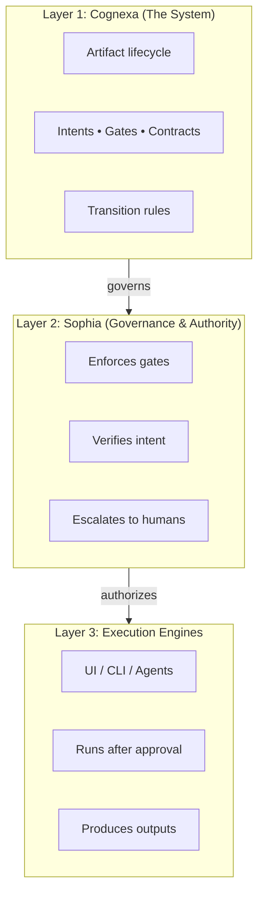

# Cognexa: A Cognitive Governance System

**Version:** 3.0.0  
**Status:** Strategic Realignment  
**Last Updated:** 2024-01-14

## 1. Executive Summary

Cognexa is a cognitive governance system designed to bring structure, intent, and accountability to complex work. It solves a critical problem in the modern, AI-assisted workplace: **decisions, intent, and accountability are scattered, implicit, and unverifiable.**

Cognexa changes this by treating **thinking as a first-class artifact**. It enforces a governed lifecycle where intent is explicit, decisions are recorded, execution is constrained, and outcomes are provable. This document outlines the architecture of the Cognexa system and the role of its core components, including its intelligence core, Sophia.

## 2. System Architecture: The Three Layers

Cognexa intentionally separates governance from execution. This separation is the core of its architecture and the primary defense against the runaway scope and untraceable changes common in AI tooling.

### Layer 1: Cognexa (The System)

This is the overarching framework that defines the **structure of thought**. It is not an application, but a protocol for governed work.

- **Defines:** The lifecycle of work (e.g., `Intent -> Contract -> Execution -> Verification`).
- **Defines:** The artifact model (`Intents`, `Gates`, `Contracts`, `Tasks`).
- **Defines:** The rules that govern transitions between phases.

### Layer 2: Sophia (Governance & Authority)

Sophia is the **Self-Organizing Platform for Human-Inclusive Autonomy**, serving as the intelligence and governance core within Cognexa. If Cognexa is the mind, Sophia is the faculty of judgment.

- **Responsibilities:**
    - **Governance Core:** Enforcing `Gates` (e.g., "requirements must be approved before coding begins"), verifying artifact hashes, and approving or rejecting phase transitions.
    - **Knowledge Fabric:** Building a living knowledge graph of processes, policies, and decisions to provide context for every action.
    - **Cognitive Orchestration:** Routing tasks and ensuring that every decision is recorded with context, confidence, and an explanation.
- **Key Characteristic:** Sophia is intentionally **conservative and transparent**. She is designed to prevent accidental progress and ensure every action is auditable. She does not execute work; she governs the conditions under which work is *allowed* to happen.

### Layer 3: Execution Engines

This layer represents the **labor** force. Execution is always subordinate to Sophia's governance.

- **Examples:**
    - This reference UI implementation.
    - CLI-based AI coding tools.
    - IDE-integrated agents.
    - Human contributors following a governed workflow.
- **Function:** To perform the "how" of the work, but only after Sophia has approved the "what" and "why".

## 3. Key Design Decisions (ADRs)

### ADR-001: Separation of Authority from Labor
- **Decision:** The system strictly separates the governance layer (Sophia) from the execution layer.
- **Context:** Collapsing these roles is the root cause of hallucinated decisions and broken trust in modern AI tools.
- **Consequence:** Execution is a commodity. The core value lies in the provable governance provided by Cognexa and Sophia.

### ADR-002: Artifact-Driven, Not AI-Driven
- **Decision:** The system is built around a verifiable chain of artifacts, not an opaque, black-box AI.
- **Context:** An AI's "reasoning" is often a post-hoc justification. An artifact chain is a provable record of decisions.
- **Consequence:** The system is auditable by design. It optimizes for correctness and defensibility, not just speed.
